# **Series : GE1FH** 

## **SET~2** 

**.** 

##### **Roll No.** 

- (I) - **27** 

> **430/1/2 Q.P. Code** 

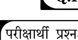

- - 

- Candidates must write the Q.P. Code on the title page of the answer-book. 

##### **NOTE** 

   - (I) Please check that this question paper contains **27** printed pages. 

- (II) - - - - 

- (III) - **38** (IV) **, -** 

- (V) - 15 - 

- 10.15 10.15 10.30 - - 

- (II) Q.P. Code given on the right hand side of the question paper should be written on the title page of the answer-book by the candidate. 

- (III) Please check that this question paper contains **38** questions. 

- (IV) **Please write down the Serial Number of the question in the answer-book at the given place before attempting it.** 

- (V) 15 minute time has been allotted to read this question paper. The question paper will  be  distributed at 10.15 a.m. From 10.15 a.m. to 10.30 a.m., the candidates will read the question paper only and will not write any answer on the answer-book during this period. 

# 

#### **MATHEMATICS (BASIC)** 

**_3_** 

_Time allowed :_ **_3_** _hours_ 

**_80_** _Maximum Marks :_ **_80_** 

**430/1/2** <mark>#</mark> **1** | P a g e 

**P.T.O.** 

- _(i) -_ **_38_** 

- 

- _(ii)_ **, , ,** 

- _(iii)_ **_1 18_** _(MCQ)_ **_19 20_** 

   - **_1_** 

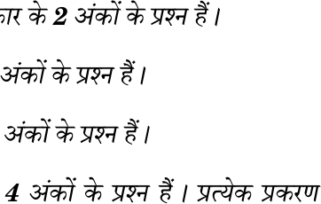

<!-- Start of picture text -->
2 4 <!-- End of picture text -->

- _(iv)_ **_21 25_** _- (VSA)_ **_2_** 

- _(v)_ **_26 31_** _- (SA)_ **_3_** 

- _(vi)_ **_32 35_** _- (LA)_ **_5_** 

- _(vii)_ **_36 38 4 2_** 

- 

- _(viii) 2 3_ 

   - , _2_ , _2_ , 

- _(ix)_ = , 

- _(x)_ 

**_20_** _(MCQ) ,_ **_1_** _20 1=20_ 

### **1.** - ? 

- (A) AAA (B) SSS (C) SAS (D) RHS 

**430/1/2** # **2** | P a g e 

##### **_General Instructions :_** 

_Read the following instructions very carefully and strictly follow them :_ 

- _(i) This question paper contains_ **_38_** _questions._ **_All_** _questions are_ **_compulsory_** _._ 

- _(ii) This question paper is divided into_ **_five_** _Sections_ **_A_** _,_ **_B, C, D_** _and_ **_E_** _._ 

- _(iii) In_ **_Section A,_** _Questions no._ **_1_** _to_ **_18_** _are Multiple Choice Questions (MCQs) and questions number_ **_19_** _and_ **_20_** _are Assertion-Reason based questions of_ **_1_** _mark each._ 

- _(iv) In_ **_Section B,_** _Questions no._ **_21_** _to_ **_25_** _are Very Short Answer (VSA) type questions, carrying_ **_2_** _marks each._ 

- _(v) In_ **_Section C,_** _Questions no._ **_26_** _to_ **_31_** _are Short Answer (SA) type questions, carrying_ **_3_** _marks each._ 

- _(vi) In_ **_Section D,_** _Questions no._ **_32_** _to_ **_35_** _are Long Answer (LA) type questions carrying_ **_5_** _marks each._ 

- _(vii) In_ **_Section E,_** _Questions no._ **_36_** _to_ **_38_** _are case study based questions carrying_ **_4_** _marks each. Internal choice is provided in_ **_2_** _marks questions in each case study._ 

- _(viii) There is no overall choice. However, an internal choice has been provided in 2 questions in Section B, 2 questions in Section C, 2 questions in Section D and 3 questions in Section E._ 

- _(ix) Draw neat diagrams wherever required. Take_ = _wherever required, if not stated._ 

- _(x) Use of calculator is_ **_not_** _allowed._ 

##### **SECTION A** 

_This section has_ **_20_** _Multiple Choice Questions (MCQs) carrying_ **_1_** _mark each. 20 1=20_ 

**1.** Which of the following is **_not_** the criterion for similarity of triangles ? 

   - (A) AAA 

   - (B) SSS 

- (C) SAS 

- (D) RHS 

**3** | P a g e 

**430/1/2** # 

**P.T.O.** 

**2.** , P - ? 

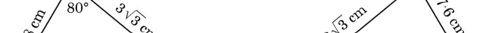

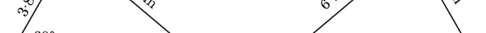

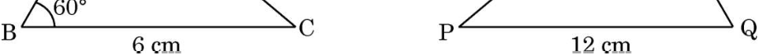

- (A) P = 60 (B) P = 80 (C) P = 40 (D) P 

##### **3.** 

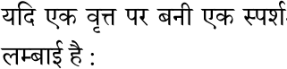

- 4 cm , 

- (A) 2 cm 

- (C) 8 cm 

(B) 4 cm 

- (D) 16 cm 

##### **4.** 

- ? 

- (A) tan 45 = cot 45 

- (B) sin 90 = tan 45 

- (C) sin 30 = cos 30 

- (D) sin 45 = cos 45 

##### **5.** 

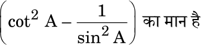

(A) 1 (B) 1 (C) 0 (D) 1 

**4** | P a g e 

**430/1/2** # 

**2.** From the figures given below, which of the following is true about the measure of P ? 

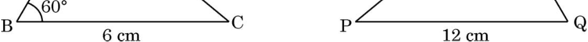

(A) P = 60 

- (B) P = 80 

- (C) P = 40 

- (D) The measure of P cannot be determined 

- If the distance of a tangent to a circle from its centre is 4 cm, then the length of diameter of the circle is : 

##### **3.** 

(A) 2 cm (B) 4 cm (C) 8 cm (D) 16 cm Which of the following statements is **_false_** ? (A) tan 45 = cot 45 

**4.** Which of the following statements is **_false_** ? 

   - (B) sin 90 = tan 45 (C) sin 30 = cos 30 (D) sin 45 = cos 45 

##### **5.** 

The value of is : 

(A) more than 1 (B) 1 

(C) 0 (D) 1 

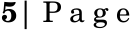

**430/1/2** # 

**P.T.O.** 

##### **6.** 

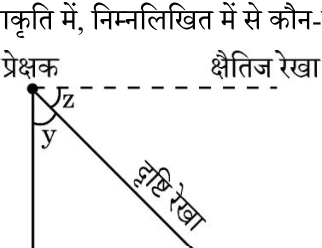

<!-- Start of picture text -->
,  - <!-- End of picture text -->

, - ? 

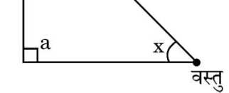

- (A) x 

- (B) y (C) z 

- (D) a 

##### **7.** 

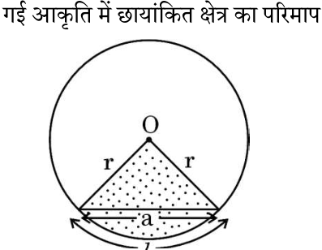

- (A) _l_ 

- (B) _l_ + a 

- (C) _l_ + 2r 

- (D) _l_ + 2r + a 

##### **8.** 

(quadrant) , 

(A) 1 : 2 (B) 2 : 1 (C) 1 : 4 (D) 4 : 1 

**6** | P a g e 

**430/1/2** # 

**6.** In the given figure, which of the following angles represents the angle of depression ? 

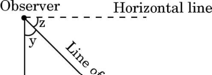

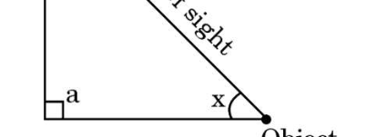

(A) x (B) y (C) z (D) a 

##### **7.** 

The perimeter of the shaded region in the given figure is : 

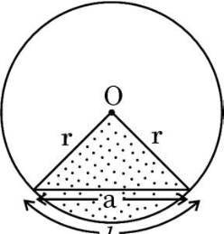

- (A) _l_ 

- (B) _l_ + a 

- (C) _l_ + 2r 

- (D) _l_ + 2r + a 

##### **8.** 

- The ratio of the area of a quadrant of a circle to the area of the same circle is : 

- (A) 1 : 2 (B) 2 : 1 (C) 1 : 4 (D) 4 : 1 

**7** | P a g e 

**430/1/2** # 

**P.T.O.** 

**9.** ? 

   - (A) 

   - (B) 

   - (C) 

   - (D) 

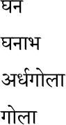

##### **10.** 

- 

|_-_|10 25|25  40|40  55|55  70|70  85|85  100|
|---|---|---|---|---|---|---|
||2|3|7|6|6|6|

- (A) 40 (B) 55 (C) 47·5 (D) 62·5 

##### **11.** 

|3000  4000|4000 5000|5000 6000|6000  7000|
|---|---|---|---|
|5|10|9|8|

   - (A) 3000 

   - (B) 4000 (C) 5000 

- (D) 6000 

- **12.** 3 , 4 7 

(A) (B) (C) (D) 

**8** | P a g e 

**430/1/2** # 

**9.** For which of the following solids is the lateral / curved surface area and total surface area the same ? 

   - (A) Cube 

   - (B) Cuboid 

   - (C) Hemisphere 

   - (D) Sphere 

**10.** The class mark of the median class of the following data is : 

|_Class Interval_|10  25|25  40|40  55|55  70|70  85|85  100|
|---|---|---|---|---|---|---|
|_Frequency_|2|3|7|6|6|6|

   - (A) 40 

   - (B) 55 

   - (C) 47·5 (D) 62·5 

**11.** The following distribution shows the number of runs scored by some batsmen in test matches : 

|_Runs_ _Scored_|3000 4000|4000  5000|5000  6000|6000 7000|
|---|---|---|---|---|
|_Number of_ _Batsmen_|5|10|9|8|

The lower limit of the modal class is : 

   - (A) 3000 

   - (B) 4000 

   - (C) 5000 

   - (D) 6000 

**12.** A bag contains 3 red, 4 white and 7 green balls. A ball is drawn at random. The probability that the ball drawn is **_not_** of red colour is : 

   - (A) (B) 

   - (C) (D) 

**9** | P a g e 

**430/1/2** # 

**P.T.O.** 

**13.** a b (HCF) 1 , (LCM) (A) a + b (B) a (C) b (D) ab **14.** (A) (B) (C) (D) 

**15.** x2 5x + 6 = 0 

(A) 1 (B) 1 (C) 49 (D) 7 **16.** x + = 3 (x 0) ax2 + bx + c = 0 a b + c (A) 5 (B) 2 (C) 1 (D) 1 **17.** P(3, 7) y- (A) 3 (B) 7 (C) 7 (D) **18.** - , (A) 1 : 2 (B) 2 : 1 (C) 1 : 1 (D) : 2 

**430/1/2** # **10** | P a g e 

|**13.**|If th|e HCF of two positive integers a and b is 1, then their LCM is :|
|---|---|---|
||(A)|a + b (B) a|
||(C)|b (D) ab|
|**14.**||is :|
||(A)|a rational number (B) an irrational number|
||(C)|an integer (D) a natural number|
|**15.**|The|discriminant of the quadratic equation  x2  5x + 6 = 0 is :|
||(A)|1 (B) 1|
||(C)|49 (D) 7|
|**16.**|The|equation x + = 3 (x 0) is expressed as a quadratic equation in the|
||form|of ax2+ bx + c = 0. The value of a b + c is :|
||(A)|5 (B) 2|
||(C)|1 (D) 1|
|**17.**|The|distance of a point P(3,  7) from y-axis is :|
||(A)|3 (B) 7|
||(C)|7 (D)|
|**18.**|The|mid-point of a line segment divides the line segment in the ratio :|
||(A)|1 : 2 (B) 2 : 1|
||(C)|1 : 1 (D) : 2|

**11** | P a g e 

**430/1/2** # 

**P.T.O.** 

**_19 20_** _(A) (R) (A), (B), (C) (D)_ 

- (A) (A) (R) (R), (A) 

- (B) (A) (R) , (R), (A) 

- (C) (A) , (R) 

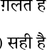

- (D) (A) , (R) 

##### **19.** 

   - _(A) :_ p , 4x + py + 8 = 0 2x + 2y + 2 = 0 , 4 

- _(R) :_ a1x + b1y = c1 a2x + b2y = c2 , = = . 

##### **20.** 

- _(A) :_ a b , a b HCF, a b LCM 

- _(R) :_ HCF, 

**_5_** _- (VSA)_ **_2_** _5 2=10_ 

**21.** 6 cm 10 cm , 

   - , 

##### **22.** 

- A B (0 A < 90 , 0 B < 90 ) , tan (A + B) = 1 tan (A B) = 

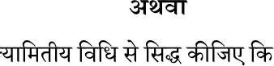

tan 45 = 1. 

**12** | P a g e 

**430/1/2** # 

_Questions number_ **_19_** _and_ **_20_** _are Assertion and Reason based questions. Two statements are given, one labelled as Assertion (A) and the other is labelled as Reason (R). Select the correct answer to these questions from the codes (A), (B), (C) and (D) as given below._ 

   - (A) Both Assertion (A) and Reason (R) are true and Reason (R) is the correct explanation of Assertion (A). 

   - (B) Both Assertion (A) and Reason (R) are true, but Reason (R) is **_not_** the correct explanation of Assertion (A). 

   - (C) Assertion (A) is true, but Reason (R) is false. 

   - (D) Assertion (A) is false, but Reason (R) is true. 

**19.** _Assertion (A) :_ The value of p for which the system of equations 4x + py + 8 = 0 and 2x + 2y + 2 = 0 is consistent is 4. 

   - _Reason (R) :_ The system of equations a1x + b1y = c1 and a2x + b2y = c2 is consistent with infinitely many solutions, if = = . 

**20.** _Assertion (A) :_ For any two natural numbers a and b, the HCF of a and b is a factor of the LCM of a and b. 

_Reason (R) :_ HCF of any two natural numbers divides both the numbers. 

##### **SECTION B** 

_This section has_ **_5_** _Very Short Answer (VSA) type questions carrying_ **_2_** _marks each. 5 2=10_ 

**21.** Two concentric circles are of radii 6 cm and 10 cm. Find the length of the chord of the larger circle which touches the smaller circle. 

**22.** (a) Find the values of A and B (0 A < 90 , 0 B < 90 ), if tan (A + B) = 1  and  tan (A B) = . 

##### **OR** 

- (b) Prove that  tan 45 = 1  geometrically. 

**13** | P a g e 

**430/1/2** # 

**P.T.O.** 

**23.** , O 2 cm 3 cm , 

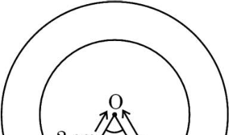

**24.** x y 

0·1x + 0·3y = 1 0·2x 0·1y = 0·1 

### **25.** , PQ RS , POQ ~ SOR. 

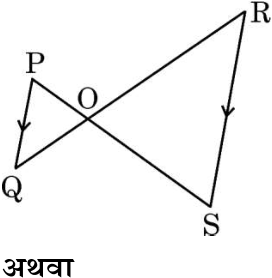

- , OSR ~ OQP, ROQ = 125 ORS = 70 . 

- OSR OQP 

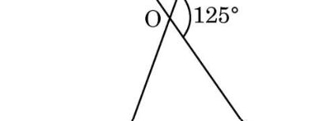

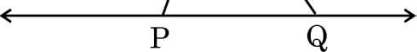

**430/1/2** # **14** | P a g e 

**23.** In the given figure, two concentric circles with centre O and radii 2 cm and 3 cm are shown. Find the perimeter of the shaded region. 

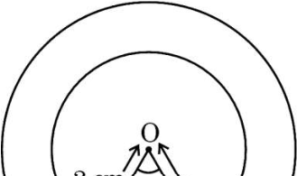

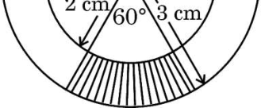

**24.** Solve for x and y : 

0·1x + 0·3y = 1 0·2x 0·1y = 0·1 

**25.** (a) In the given figure, if PQ RS, then prove that POQ ~ SOR. 

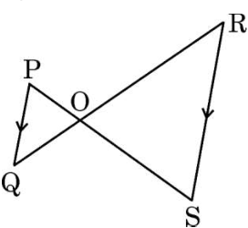

##### **OR** 

- (b) In the given figure, OSR ~ OQP, ROQ = 125 and ORS = 70 . Find the measures of OSR and OQP. 

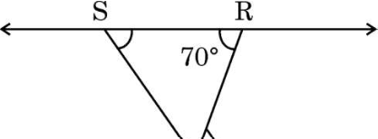

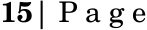

<!-- Start of picture text -->
15 | P a g e <!-- End of picture text -->

**430/1/2** # 

**P.T.O.** 

_6 3=18_ 

**_6_** 

_-_ 

_(SA) ,_ **_3_** 

##### **26.** 

x + 3y = 6; 2x 3y = 12 

x y x : y = 1 : 2. 

##### **27.** 

##### **28.** 

##### **29.** 

= sec A tan A 

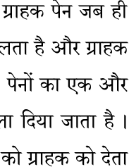

200 180 , ? 100 80 , 200 , ? 

##### **30.** 

**16** | P a g e 

**430/1/2** # 

##### **SECTION C** 

_This section has_ **_6_** _Short Answer (SA) type questions carrying_ **_3_** _marks each. 6 3=18_ 

##### **26.** (a) Solve the following system of equations graphically : 

- x + 3y = 6;  2x 3y = 12 

##### **OR** 

   - (b) x and y are complementary angles such that x : y = 1 : 2. Express the given information as a system of linear equations in two variables and hence solve it. 

**27.** Prove that a rectangle circumscribing a circle is a square. 

##### **28.** Prove the following trigonometric identity : 

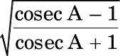

= sec A tan A 

**29.** A lot consists of 200 pens of which 180 are good and the rest are defective. A customer will buy a pen if it is not defective. The shopkeeper draws a pen at random and gives it to the customer. What is the probability that the customer will not buy it ? Another lot of 100 pens containing 80 good pens is mixed with the previous lot of 200 pens. The shopkeeper now draws one pen at random from the entire lot and gives it to the customer. What is the probability that the customer will buy the pen ? 

**30.** (a) Prove that is an irrational number. 

##### **OR** 

**17** | P a g e 

**430/1/2** # 

**P.T.O.** 

##### x 

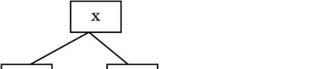

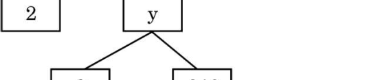

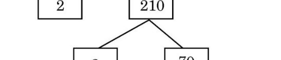

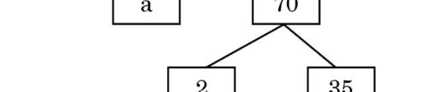

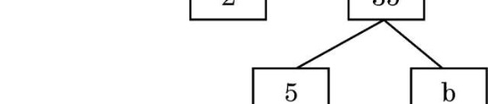

x, y, a b x 

**31.** , 5 6 , 

**_4_** _- (LA) ,_ **_5_** 

##### **32.** 

- 

, 

**18** | P a g e 

**430/1/2** # 

- (b) The factor tree of a number x is shown below : 

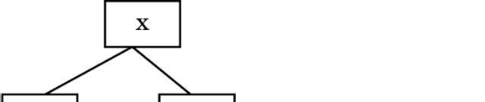

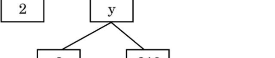

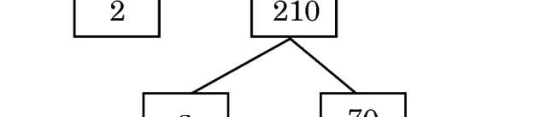

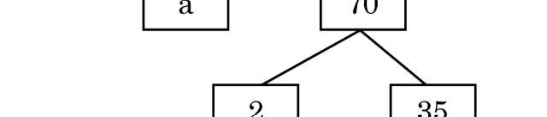

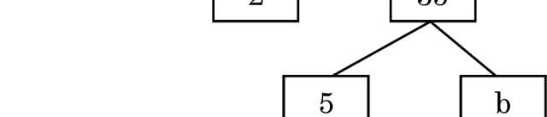

Find the values of x, y, a and b. Hence, write the product of the prime factors of the number x so obtained. 

**31.** Find a quadratic polynomial, sum and product of whose zeroes are 5 and 6, respectively. Also, find the zeroes of the polynomial so obtained. 

##### **SECTION D** 

_This section has_ **_4_** _Long Answer (LA) type questions carrying_ **_5_** _marks each. 4 5=20_ 

##### **32.** 

- A line through the mid-point of one side of a triangle, parallel to another side, bisects the third side. 

**19** | P a g e 

**430/1/2** # 

**P.T.O.** 

##### **33.** 

- 5 cm , 

3·5 cm , ? 

**34.** 68 

|50  100|4|
|---|---|
|100 150|5|
|150 200|13|
|200 250|20|
|250 300|14|
|300 350|8|
|350 400|4|

**35.** 180 , 

8 

k 2x2 + kx + 3 = 0 

**20** | P a g e 

**430/1/2** # 

**33.** (a) A toy is in the form of a cone surmounted on a hemisphere. The cone and hemisphere have the same radii. The height of the conical part of the toy is equal to the diameter of its base. If the radius of the conical part is 5 cm, find the volume of the toy. 

##### **OR** 

   - (b) A cubical block is surmounted by a hemisphere of radius 3·5 cm. What is the smallest possible length of the edge of the cube so that the hemisphere can totally lie on the cube ? Find the total surface area of the solid so formed. 

**34.** The following frequency distribution gives the monthly consumption of electricity of 68 consumers of a locality. Find the monthly mean consumption from the data. 

|_Monthly Consumption_ _(in units)_|_Number of_ _Consumers_|
|---|---|
|50 100|4|
|100  150|5|
|150  200|13|
|200  250|20|
|250  300|14|
|300  350|8|
|350  400|4|

**35.** (a) The difference of the squares of two positive numbers is 180. The square of the smaller number is 8 times the greater number. Find the two numbers. 

##### **OR** 

- (b) Find the value(s) of k for which the equation 2x2 + kx + 3 = 0 has real and equal roots. Hence, find the roots of the equations so obtained. 

**21** | P a g e 

**430/1/2** # 

**P.T.O.** 

**_3_** 

**_4_** _3 4=12_ 

_,_ 

##### **1** 

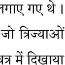

**36.** , , A B , 50 cm, 100 cm, 150 cm, ....... A , 1 10 , 2 20 , 3 30 

, 

(i) 13 ? _1_ (ii) n 500 cm , n _1_ (iii) 11 ? _2_ 

- , 450 ? 

_2_ 

**22** | P a g e 

**430/1/2** # 

_This section has_ **_3_** _case study based questions carrying_ **_4_** _marks each. 3 4=12_ 

##### **SECTION E** 

##### **Case Study 1** 

**36.** In a garden, saplings of rose flowers were planted at equal intervals to form a spiral pattern. The spiral is made up of successive semicircles, with centres alternatively at A and B, starting with centre at A, of radii 50 cm, 100 cm, 150 cm, ....... as shown in the figure given below. Spiral 1 has 10 flowers, Spiral 2 has 20 flowers, Spiral 3 has 30 flowers and so on. 

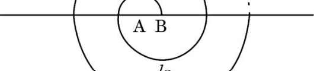

Based on the above information, answer the following questions : 

- (i) What is the radius of the 13th spiral ? _1_ (ii) If the radius of the nth spiral is 500 cm, find the value of n. _1_ (iii) (a) Find the total number of saplings till the 11th spiral. _2_ **OR** 

- (b) Till which spiral, will there be a total of 450 saplings ? _2_ 

**23** | P a g e 

**430/1/2** # 

**P.T.O.** 

**2** 

_1_ 

**37.** A(10, 20) B(50, 50) , P Q, 

AB , AP = PQ = QB. 

, 

- (i) C 

- (ii) 

_1_ 

- (iii) P 

- _2_ 

A Q 

_2_ 

**24** | P a g e 

**430/1/2** # 

##### **Case Study 2** 

**37.** In a society, there is a circular park having two gates. The gates are placed at points A(10, 20) and B(50, 50), as shown in the figure below. Two fountains are installed at points P and Q on AB such that AP = PQ = QB. 

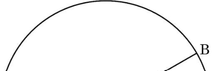

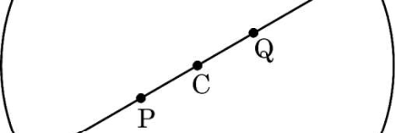

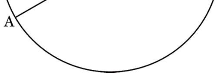

Based on the above information, answer the following questions : 

|(i)|Find|the coordinates of the centre C.|_1_|
|---|---|---|---|
|(ii)|Find|the radius of the circular park.|_1_|
|(iii)|(a)|Find the coordinates of the point P.|_2_|
|||**OR**||
||(b)|Find the distance of the fountain at Q from gate A.|_2_|

**25** | P a g e 

**430/1/2** # 

**P.T.O.** 

**3** 

**38.** 15 m , 

   - 60 

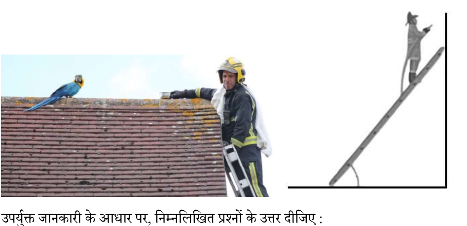

<!-- Start of picture text -->
, <!-- End of picture text -->

- (i) , 

- (ii) , 

_1_ 

   - _1_ 

- (iii) , , 30 

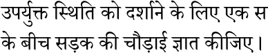

- 

   - _2_ 

- , 

- _2_ 

**26** | P a g e 

**430/1/2** # 

##### **Case Study 3** 

**38.** An injured bird was found on the roof of a building. The building is 15 m high. A fireman was called to rescue the bird. The fireman used an adjustable ladder to reach the roof. He placed the ladder in such a way that the ladder makes an angle of 60 with the ground in order to reach the roof. 

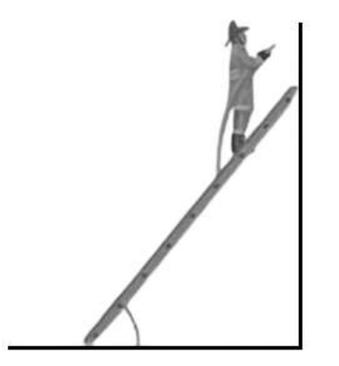

Based on the above information, answer the following questions : 

- (i) Find the length of the ladder used by the fireman to reach the roof. (ii) Find the distance of the point on the ground at which the ladder was fixed from the bottom of the building. 

_1_ 

_1_ 

- (iii) In order to avoid skidding, the fireman placed the ladder in such a way that the bottom of the ladder touches the base of the wall which is opposite to the building, making an angle of 30 with the ground. 

   - (a) Draw a neat diagram to represent the above situation and hence find the width of the road between the building and the wall. 

_2_ 

##### **OR** 

- (b) Find the length of the ladder used by the fireman in this case. _2_ 

**27** | P a g e 

**430/1/2** # 

**P.T.O.** 

